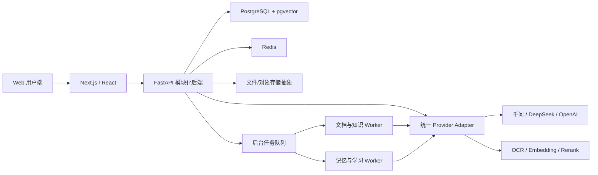

# AI 教材家教与自生长知识库平台设计

- 版本：v1.0
- 日期：2026-08-14
- 状态：六个设计部分已口头确认，等待正式文档终审
- 部署路线：本机 Docker 验证，成功后迁移 Linux 云服务器

## 1. 产品定位

本平台面向学生、教师和自主学习者。用户上传课本、练习册、图片、Markdown 或已有 Obsidian 知识库后，系统将资料整理为可检索、可追溯、可持续生长的个人或班级知识空间，并提供基于教材证据的 AI 答疑、出题、错题整理和长期学习记忆。

平台不是简单的“把整本 PDF 每次直接发送给大模型”。原文件会被保留，同时建立可重复使用的文本、图片、公式、页码和知识关系索引。这样既能减少重复调用费用，也能让回答稳定定位到具体教材和页码。

### 1.1 首版目标

1. 支持注册登录和严格的多用户数据隔离。
2. 支持个人空间、班级空间、邀请码加入和教师审核分享。
3. 支持 PDF、DOCX、Markdown、JPG、PNG 和 Obsidian Vault 导入。
4. 建立可追溯的混合检索知识库、AI 笔记和关系图。
5. 提供默认完整解答，可由用户切换为分步引导。
6. 提供用户可控制的长期学习记忆。
7. 接入千问、DeepSeek、OpenAI 系列模型，并支持后台更换 OCR、Embedding 和 Rerank 服务。
8. 使用平台统一 API Key、人民币预付钱包和按官方 API 原价结算。
9. 在普通用户界面隐藏内部技术流程，只显示必要状态、结果、来源和费用。

### 1.2 首版不做

- 不在首版接入自动支付，充值由管理员人工处理。
- 不把关系图直接作为唯一检索引擎；首版使用全文与向量混合检索，图谱用于浏览、筛选和辅助扩展。
- 不允许用户自行填写供应商 API Key。
- 不允许 AI 修改原始教材文件。
- 不把教师默认设为可查看学生私人对话、私人错题或长期记忆。
- 不承诺一次性兼容所有复杂 PDF 版式；失败页面必须可定位、可复核和可重新处理。

## 2. 产品原则

### 2.1 用户界面简单，内部能力完整

普通用户只看到“正在准备、可以使用、需要处理、处理失败”等简单状态。OCR、切分、Embedding、重排、重试和 Agent 工具调用不会以步骤流展示。来源、用量和费用可以展开查看，完整调用链仅供管理员在诊断区使用。

### 2.2 原始资料与 AI 生成内容分离

原教材、练习册和用户上传的笔记是不可被 AI 静默改写的来源层。AI 摘要、概念笔记、题目、标签和关系属于生成层，必须保存生成时间、模型、证据和版本，并支持撤销。

### 2.3 回答必须可追溯

回答优先引用当前空间中用户有权访问的资料。引用至少包含教材名、章节和页码；点击后打开原页或原文定位。教材依据不足时，回答必须区分“教材中明确说明”和“模型补充知识”。

### 2.4 权限、费用和记忆均可审计

班级分享、教师审核、余额变动、模型调用和记忆更新均形成可追溯记录。敏感内容默认最小可见，资金流水不直接覆盖修改。

## 3. 用户、空间与权限

### 3.1 角色

- 平台用户：任何完成注册的用户，可使用个人空间，也可创建班级。
- 班级创建者：拥有该班级最高权限，可设置或撤销其他教师、管理邀请码和班级设置。
- 教师：可审核资料、管理班级知识库和发布班级 AI 内容，但不能移除班级创建者。
- 学生：可使用班级已批准资料，也可在个人空间上传和学习。
- 平台管理员：管理供应商配置、价格版本、人工充值和系统运行；默认不浏览用户教材正文、对话和记忆。

产品只保留“教师”和“学生”两种班级成员角色，显示名称可以由班级创建者自定义，例如“助教”“学员”，但底层权限语义不变。

### 3.2 数据归属

所有知识资源必须归属于一个空间：个人空间或班级空间。即使用户在班级资料上提问，该用户产生的私人会话、错题、学习进度和长期记忆仍同时归属于该用户，不会自动共享给教师或其他成员。

### 3.3 学生资料分享

1. 学生上传资料后，原件和生成知识默认仅存在于个人空间。
2. 学生选择“提交到班级”时冻结一个提交版本，后续个人编辑不会静默改变待审核内容。
3. 教师可批准、驳回或要求修改。
4. 批准后，班级空间创建受控引用或副本，并保存提交者、审核者和版本。
5. 撤销班级分享只影响班级引用，不删除学生的个人原件。

### 3.4 主要权限矩阵

| 操作 | 个人空间所有者 | 班级创建者 | 教师 | 学生 |
|---|---:|---:|---:|---:|
| 使用个人资料与 AI | 是 | 仅自己的 | 仅自己的 | 仅自己的 |
| 创建班级 | 是 | 是 | 是 | 是 |
| 管理邀请码 | 不适用 | 是 | 可配置 | 否 |
| 任命教师 | 不适用 | 是 | 否 | 否 |
| 上传到个人空间 | 是 | 是 | 是 | 是 |
| 直接发布班级资料 | 不适用 | 是 | 是 | 否 |
| 提交个人资料供班级审核 | 不适用 | 是 | 是 | 是 |
| 审核班级资料与 AI 笔记 | 不适用 | 是 | 是 | 否 |
| 查看他人私人会话/记忆 | 否 | 否 | 否 | 否 |

后端每个查询和写入都必须同时校验用户、空间、成员关系与资源状态，不能只依赖前端是否显示按钮。

## 4. 主界面设计

主工作台采用已确认的 C3 结构，并借鉴 Obsidian 的层级和工作区操作习惯：

1. 最左栏：个人空间与各班级空间切换。
2. 第二栏：当前空间内的教材与练习、文件、知识图谱、AI 笔记、错题集、题库；班级空间额外显示审核与成员管理。
3. 中间区域：原始资料、知识笔记、关系图和题库的标签页工作区。
4. 右侧区域：AI 家教对话。

第二栏、中间工作区和右侧答疑区由两条分隔线控制宽度，用户拖动结果按账号保存。窄屏时右侧答疑区改为可展开抽屉。

用户可在答疑区选择管理员已启用的大模型，并设置“完整解答”或“分步引导”。默认显示完整解答。模型选择旁展示清楚的计价说明，但不显示 API Key 或供应商内部配置。

知识图谱用于观察章节、概念、例题、错题和笔记之间的关系；点击节点可以过滤资料、打开原文或发起提问。首版不让关系图承担所有答案检索，以避免图谱尚未完善时降低准确率。

## 5. 总体技术架构

采用“自主平台 + 选择性复用 DeepTutor 技术模块”的路线，而不是直接修改整个 DeepTutor 产品。



- 前端：Next.js + React，负责多栏工作台、PDF/图片预览、关系图、流式回答和管理后台。
- 后端：FastAPI 模块化单体，统一处理认证、空间权限、知识库、对话、班级、审核、记忆和计费事务。
- Worker：文档解析、OCR、Embedding、AI 笔记、出题和记忆整理独立执行，避免阻塞用户请求。
- 数据库：PostgreSQL 保存业务数据、权限、记忆、账单和图关系；pgvector 保存向量。
- Redis：任务队列、短期缓存、速率限制和分布式锁。
- 文件存储：本机使用兼容对象存储或受控目录，云端切换为对象存储服务，不改变业务接口。
- Provider Adapter：统一不同供应商的请求、流式响应、usage、错误和重试语义。

首版保持模块化单体，避免过早拆分大量微服务；耗时 Worker 可以独立扩容。

## 6. 核心数据模型

主要实体如下：

- User、Session、UserPreference
- Space、Classroom、ClassMembership、InviteCode
- Resource、Document、DocumentVersion、Page、Block、Asset
- ShareSubmission、ShareReview、PublishedReference
- KnowledgeBase、IndexVersion、Chunk、EmbeddingRecord
- KnowledgeNode、KnowledgeEdge、GeneratedNote、Question、WrongAnswer
- Conversation、Message、Citation、AgentRun、ToolCall
- MemoryEvent、MemoryFact、MemorySummary、LearnerProfile
- ProviderProfile、ModelSnapshot、PriceVersion、FxVersion
- Wallet、WalletReservation、LedgerEntry、UsageRecord、RechargeRecord
- Job、JobAttempt、AuditEvent

关键约束：

1. 每个资源必须带 `space_id`；私人学习数据还必须带 `owner_user_id`。
2. 文档与 AI 内容均版本化，发布状态不能覆盖历史版本。
3. 向量记录必须绑定索引版本和 Embedding 签名，禁止不同维度或模型静默混用。
4. 账本和审核事件采用追加记录；更正使用新记录反向冲销。
5. 删除用户内容时，原文件、派生块、向量、图关系、缓存和记忆均进入可核验的级联删除任务。

## 7. 教材导入与自生长知识库

### 7.1 支持格式

- PDF：文本型、扫描型或混合型。
- DOCX：段落、标题、表格、图片和公式尽可能保留结构。
- Markdown：正文、Frontmatter、标签、附件和链接。
- JPG/PNG：作为单页或补充材料。
- Obsidian Vault：文件夹或 ZIP，保留目录、附件、标签、Frontmatter 和 `[[双向链接]]`。

### 7.2 解析策略

系统优先读取 PDF/DOCX 的原生文本和结构，只对没有可靠文本、乱码、公式密集或版面复杂的页面调用 OCR。每页保留原页图像或原文件定位，同时记录文本块的页码、坐标和来源。

这样既保留了大模型直接看图片和公式的能力，又避免每次问答重复把整本书交给视觉模型。提问涉及图形、公式或版面时，Agent 可以在检索到对应页后再回看原页图像。

标准化层级为：文档 → 页面 → 结构块 → 资源附件。结构块可为标题、正文、公式、表格、图片说明、例题、题目或答案区域，并保存坐标框和来源指针。

### 7.3 索引与关系

- 全文索引处理精确术语、题号和章节名。
- pgvector 处理语义相近的问题。
- 可选 Rerank 对候选证据重新排序。
- 章节、概念、例题、公式、知识点和 Obsidian 双向链接写入关系图。

索引使用不可变版本。解析器、OCR、切分、Embedding 模型、维度和参数共同组成 `index_signature`。新索引完整构建并通过检查后才原子切换为活动版本；失败时继续使用旧版本。

相同文件或页面通过内容哈希复用解析、OCR 和 Embedding 结果，避免重复收费。后台任务支持断点恢复，失败页面可单独重试。

### 7.4 自生长内容

系统可以根据新资料和学习行为生成章节摘要、概念笔记、关系、题目、错题归纳和复习建议。生成内容必须附来源、模型和版本。

- 个人空间：可自动写入，但用户可撤销、修改或关闭自动生长。
- 班级空间：生成后先成为草稿，教师审核通过才向全班发布。

## 8. Agent 答疑与学习模式

每次提问先校验空间和余额，再从相关记忆和当前空间知识库中选择必要证据。Agent 仅能使用白名单工具，例如检索教材、打开原页、读取图谱邻居、查询错题和生成练习，不允许任意执行外部操作。

上下文采用动态预算：只加入与当前问题有关的近期对话、长期记忆和教材证据，不把全部历史或整本教材塞入提示词。完整历史仍保存在数据库中。

回答结构：

1. 直接回答或分步引导。
2. 关键推导、公式或图形说明。
3. 教材证据引用。
4. 若需要，明确标记模型补充知识。
5. 可选的同类练习或检查问题。

完整解答为默认模式。分步引导开启后，Agent 每次只给适量提示并等待学生作答，但用户可以随时选择“查看完整解答”。

系统对工具循环次数、响应时间、最大输出和预估费用设置上限。达到限制时应给出已有结果和简洁提示，而不是无限继续调用。

## 9. 长期学习记忆

长期记忆用于减少重复沟通和建立个性化学习支持，不作为不可质疑的事实源。

- L0 原始事件：提问、答题、查看资料、用户反馈和错题等可追溯事件。
- L1 原子事实：例如“在一次一元方程移项中多次符号出错”，带来源、时间和置信度。
- L2 学科摘要：按学科或教材整理近期掌握、薄弱点和进度。
- L3 稳定画像：长期偏好、常用解题方式和较稳定的学习特征。

召回时综合语义相关性、学科、时效、置信度和用户明确确认。新证据与旧记忆冲突时不直接覆盖，而是降低旧记忆权重或创建新版本。

用户可以查看、修改、删除记忆，也可以关闭自动记忆。教师默认不能查看学生的私人记忆。删除或修改后，后续回答不再继续使用旧内容。

## 10. 供应商与环境配置

千问、DeepSeek、OpenAI 以及 OCR、Embedding、Rerank 均通过适配器接入。供应商名称、模型名称、API Key、Base URL、能力映射和超时等源配置全部由服务端环境变量注入。

```text
QWEN_API_KEY=...
QWEN_BASE_URL=...
QWEN_MODELS_JSON=[...]
DEEPSEEK_API_KEY=...
DEEPSEEK_BASE_URL=...
DEEPSEEK_MODELS_JSON=[...]
OPENAI_API_KEY=...
OPENAI_BASE_URL=...
OPENAI_MODELS_JSON=[...]
OCR_PROFILES_JSON=[...]
EMBEDDING_PROFILES_JSON=[...]
RERANK_PROFILES_JSON=[...]
```

仓库只提交 `.env.example`，不提交真实密钥。浏览器和普通接口永远不返回密钥。数据库只保存环境配置派生出的非秘密 ID、启用状态、能力和不可变运行快照。

管理员修改环境配置并重启后，先执行最小连接测试和 usage 字段验证，再决定是否向用户启用。LLM 启用后出现在用户模型选择器中。OCR、Embedding 和 Rerank 的切换默认只影响新知识库或新索引；已有知识库必须明确发起可回滚的重建。

## 11. 官方原价、钱包与结算

### 11.1 定价原则

用户按调用发生时的官方标准 API 按量原价结算，不使用 ChatGPT 订阅、Coding Plan、会员套餐或其他不可用于商业转售的计划价格。平台若获得供应商折扣，只能在供应商商业条款允许的情况下作为平台采购成本优势，不改变用户侧已公开的官方按量原价。

首批官方来源：

- OpenAI API：<https://openai.com/api/pricing/>
- DeepSeek API：<https://api-docs.deepseek.com/quick_start/pricing/>
- 阿里云百炼模型调用原价：<https://help.aliyun.com/zh/model-studio/model-pricing>
- 人民币汇率参考：中国外汇交易中心公布的人民币兑美元汇率中间价

价格可能随时变化，因此不能写死在业务代码中。首版采用“系统提醒、管理员官网复核、发布新价格版本”；后续自动采集也必须经过差异审核才能生效。

价格版本能够表达供应商、精确模型、输入、缓存命中、输出、工具调用、图片、页数、请求、上下文阶梯、计价单位、币种、来源 URL 和生效时间。历史账单永久保存调用时价格快照。

美元价格按调用时有效的汇率版本转换为人民币。默认采用中国外汇交易中心当日人民币兑美元中间价，节假日沿用最近发布值；来源日期、汇率和审核人写入账单。

### 11.2 钱包闭环

1. 请求前根据模型、输入和最大输出估算费用上限。
2. 数据库事务预留可用余额，余额不足时不调用供应商。
3. 调用后读取供应商返回的真实 usage。
4. 按实际输入、缓存命中、输出、OCR 页数或其他官方单位结算。
5. 释放未使用的预留金额，并写入不可变账本。

金额使用高精度 Decimal/NUMERIC，不使用浮点数。界面可以显示两位人民币，但账本保留足够精度，余额由账本汇总与事务控制。

无法可靠取得真实 usage 的模型不能开放生产计费。平台内部重试不重复向用户收费；仅供应商已确认产生并能核验的实际用量才进入用户账单。相同文件命中平台解析或向量缓存时不重复收取相应处理费用。

### 11.3 人工充值

首版由管理员输入用户、金额、凭证备注和原因，系统生成充值流水。充值记录不能直接修改；录错时新增冲正记录。用户可查看当前余额、充值和消费明细，Token 等技术明细默认折叠。

## 12. 错误处理与恢复

普通用户只接触简单状态和可执行动作：等待、继续使用、重新处理、联系管理员。内部错误码、供应商响应和任务步骤不直接暴露。

- 所有后台任务带幂等键，重复提交不会创建重复知识或重复账单。
- 文档处理按文件和页面保存检查点，服务重启后继续未完成部分。
- 可恢复错误使用有限次数退避重试；持续失败进入待处理队列。
- 新索引失败时不影响当前活动索引。
- 流式回答中断时保留已生成内容；是否收费以可核验 usage 为准。
- 日志使用统一请求/任务编号，并对 API Key、Cookie、用户文本和教材正文脱敏。
- 管理员可查看供应商、耗时、重试、usage 和价格版本，但查看用户正文需要单独授权并留下审计记录。

## 13. 安全、隐私与内容治理

1. 密码使用强哈希保存，登录会话支持撤销和过期。
2. 所有资源访问都执行服务端空间权限校验，文件下载使用短时授权地址。
3. API Key 仅存在于服务端环境与运行时，不进入前端、日志和普通数据库字段。
4. 生产环境全站 HTTPS，数据库和对象存储限制为内部访问。
5. 用户可导出或删除个人数据；删除流程覆盖原件、派生索引、缓存和记忆。
6. 班级共享前提示上传者确认其拥有使用和分享教材的权利；平台提供下架与投诉处理入口。
7. 若面向未成年人正式运营，需要在上线前补充监护人同意、隐私政策、数据保留期限和适用地区的教育/未成年人合规评估。

## 14. 测试与首版验收

### 14.1 自动化测试

- 权限：覆盖个人/班级、创建者/教师/学生、审核前后、退出班级和撤销分享的矩阵测试。
- 隔离：随机用户不能通过接口、搜索、引用、文件地址或关系图读取其他用户数据。
- 计费：Decimal 计算、阶梯价格、缓存价、汇率、并发预留、失败释放、幂等结算和冲正必须精确通过。
- 供应商契约：使用模拟响应验证流式事件、usage、超时、429、5xx 和不完整响应。
- 文档：使用固定 PDF、扫描页、DOCX、Markdown 和 Obsidian Vault 验证页码、公式、附件与双向链接。
- 检索：维护固定教材问答集，检查正确证据是否进入候选结果、最终引用是否落在正确页面。
- 端到端：注册、充值、上传、知识库可用、提问、引用回看、出题、错题、记忆、班级审核完整运行。
- 恢复：在解析、向量化和回答过程中重启服务，确认可续传且不重复收费。

### 14.2 验收底线

1. 权限和资金测试必须全部通过，不接受“偶发跨用户数据”或账本误差。
2. 支持格式可完成上传并给出明确结果；局部失败能够定位到文件或页面。
3. 基于教材的回答能够点击引用并打开正确来源页。
4. 个人和班级空间切换、三级工作区拖动及账号布局记忆可用。
5. 学生资料未经审核不会出现在班级知识库。
6. 用户可选择启用模型、查看余额和本轮费用。
7. 用户可查看、修改、删除或关闭长期记忆。
8. Docker 本机环境在全新机器按文档能够启动，并能完成一条端到端学习链路。

## 15. 本机部署与云迁移

本机使用 Docker Compose 组织 Web、API、Worker、PostgreSQL/pgvector、Redis 和对象存储兼容服务。真实 API 密钥放在本机 `.env`，测试环境可使用模拟供应商避免产生费用。

云迁移目标为 Linux 服务器：

- 容器镜像和数据库迁移保持一致。
- 本机文件存储切换为云对象存储实现。
- 增加反向代理、HTTPS、域名、监控、告警和定时备份。
- PostgreSQL、对象存储和环境密钥分别备份；定期执行恢复演练。
- Worker 可按文档处理量独立扩容，Web/API 仍保持无状态或少状态部署。

## 16. DeepTutor 参考与复用边界

参考项目：[HKUDS/DeepTutor](https://github.com/HKUDS/DeepTutor)。其 Apache-2.0 许可、FastAPI/Next.js 技术路线、统一 Agent Loop、文档解析适配器、RAG 管线、知识库原文预览、题库和分层记忆设计具有参考价值。

优先评估复用或改造的部分：

- Provider、解析器和检索适配器的接口组织方式。
- Agent 工具注册、运行时上下文和流式事件设计。
- 文档解析、索引版本和引用原文的实现思路。
- 题目生成、学习掌握和分层记忆中的独立算法模块。

自主实现的核心部分：

- 个人/班级空间和完整权限模型。
- 学生提交、教师审核和受控发布。
- 人民币钱包、官方价格版本、usage 账本和人工充值。
- 本平台 C3 工作台、Obsidian 风格层级和用户记忆控制。
- 统一的数据归属、删除、审计和多租户安全边界。

任何直接复制或修改的 DeepTutor 代码都必须在引入前核对文件许可、依赖许可和 NOTICE 要求，并保留 Apache-2.0 归属；不把 DeepTutor 整体作为本产品底座直接二次发布。

## 17. 实施阶段顺序

1. 工程骨架、Docker、本地服务和自动化测试框架。
2. 注册登录、空间、班级、邀请、权限和审计。
3. 供应商适配器、环境配置、价格版本、钱包和人工充值。
4. 文件上传、原始资料存储、解析/OCR 和索引版本。
5. 混合检索、引用回看、知识树与关系图。
6. Agent 答疑、完整解答/分步引导、题库和错题。
7. L0-L3 长期记忆、自生长草稿和班级审核。
8. 故障恢复、安全、账单准确性、端到端验收和云迁移文档。

## 18. 实施前需要提供的运行参数

以下内容属于部署参数，不改变本设计：

- 本机 Docker Desktop 的可用状态和可分配资源。
- 千问、DeepSeek、OpenAI、OCR、Embedding、Rerank 的 API Key 与 Base URL。
- 首批启用模型清单；模型名称和价格将在接入当天从官方页面复核并生成首个版本。
- 平台正式名称、Logo、域名和人工充值凭证规则。

在这些参数尚未提供时，可使用模拟供应商和占位品牌完成绝大部分本地开发与自动化测试。
